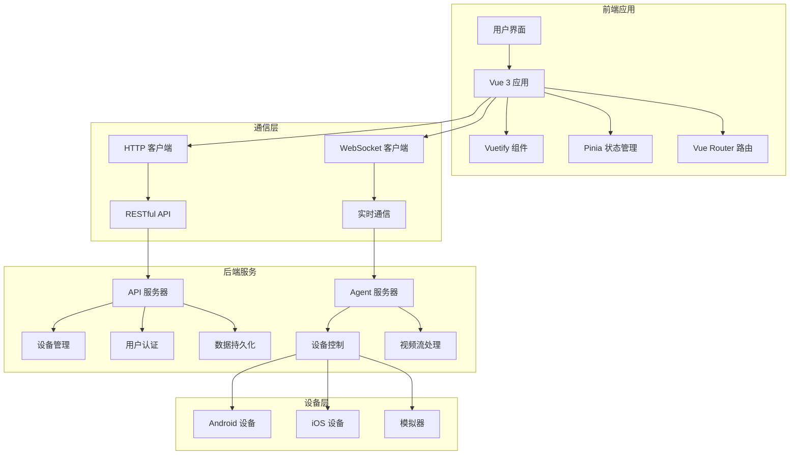

# 架构设计

High QA 采用现代化的前端架构设计，基于 Vue 3 + TypeScript + Vuetify 构建，提供高可维护性和可扩展性的解决方案。

## 🏗️ 整体架构

### 技术栈

```
┌─────────────────────────────────────────────────────────────┐
│                     High QA 技术栈                           │
├─────────────────────────────────────────────────────────────┤
│ 前端框架      │ Vue 3 (Composition API)                    │
│ 状态管理      │ Pinia                                      │
│ 路由管理      │ Vue Router 4                               │
│ UI 组件库     │ Vuetify 3                                  │
│ 类型检查      │ TypeScript                                 │
│ 构建工具      │ Vite                                       │
│ 代码规范      │ ESLint + Prettier                          │
│ 测试框架      │ Vitest + Vue Test Utils                    │
│ 实时通信      │ WebSocket                                  │
│ 数据可视化    │ ECharts                                    │
└─────────────────────────────────────────────────────────────┘
```

### 系统架构图



## 📁 项目结构

### 目录结构

```
src/
├── api/                    # API 接口定义
│   ├── modules/           # 模块化 API
│   │   ├── auth.ts       # 认证相关
│   │   ├── device.ts     # 设备管理
│   │   ├── user.ts       # 用户管理
│   │   └── udt-agent.ts  # UDT Agent
│   ├── request.ts        # 请求封装
│   └── types.ts          # API 类型定义
├── components/            # 通用组件
│   ├── common/           # 基础组件
│   │   ├── DataTable.vue
│   │   ├── StatCard.vue
│   │   └── LoadingSpinner.vue
│   ├── forms/            # 表单组件
│   └── charts/           # 图表组件
├── composables/          # 组合式函数
│   ├── useApi.ts
│   ├── useAuth.ts
│   └── useDevice.ts
├── hooks/                # 自定义 Hooks
│   ├── useUdtAgent.ts
│   └── useWebSocket.ts
├── layouts/              # 布局组件
│   ├── DefaultLayout.vue
│   └── AuthLayout.vue
├── plugins/              # 插件配置
│   ├── vuetify.ts
│   └── pinia.ts
├── router/               # 路由配置
│   ├── index.ts
│   └── modules/
├── store/                # 状态管理
│   ├── modules/
│   │   ├── auth.ts
│   │   ├── device.ts
│   │   └── udtAgent.ts
│   └── index.ts
├── types/                # TypeScript 类型定义
│   ├── common.ts
│   ├── device/
│   ├── user/
│   └── index.ts
├── utils/                # 工具函数
│   ├── request.ts
│   ├── storage.ts
│   └── helpers.ts
├── views/                # 页面组件
│   ├── dashboard/
│   ├── device/
│   ├── automation/
│   └── resource/
├── App.vue               # 根组件
└── main.ts               # 入口文件
```

## 🔧 核心架构

### 组件架构

```typescript
// 组件层次结构
interface ComponentArchitecture {
  // 页面级组件
  pages: {
    dashboard: DashboardPage
    device: DevicePage
    automation: AutomationPage
  }
  
  // 布局组件
  layouts: {
    default: DefaultLayout
    auth: AuthLayout
  }
  
  // 业务组件
  business: {
    deviceControl: DeviceControlComponent
    testSuite: TestSuiteComponent
  }
  
  // 基础组件
  common: {
    dataTable: DataTableComponent
    statCard: StatCardComponent
  }
}
```

### 状态管理架构

```typescript
// Pinia Store 架构
interface StoreArchitecture {
  // 认证状态
  auth: {
    user: UserInfo
    token: string
    permissions: Permission[]
  }
  
  // 设备状态
  device: {
    devices: DeviceInfo[]
    selectedDevice: DeviceInfo | null
    filterOptions: FilterOptions
  }
  
  // UDT Agent 状态
  udtAgent: {
    connectionHistory: ConnectionHistory[]
    currentConnection: AgentConnection | null
    deviceInfo: DeviceInfo | null
  }
}
```

## 🌐 通信架构

### HTTP 通信

```typescript
// HTTP 客户端封装
class HttpClient {
  private baseURL: string
  private timeout: number = 30000
  
  constructor(baseURL: string) {
    this.baseURL = baseURL
  }
  
  async request<T>(config: RequestConfig): Promise<ApiResponse<T>> {
    const response = await fetch(`${this.baseURL}${config.url}`, {
      method: config.method || 'GET',
      headers: {
        'Content-Type': 'application/json',
        ...config.headers
      },
      body: config.data ? JSON.stringify(config.data) : undefined
    })
    
    if (!response.ok) {
      throw new Error(`HTTP ${response.status}: ${response.statusText}`)
    }
    
    return response.json()
  }
}
```

### WebSocket 通信

```typescript
// WebSocket 管理器
class WebSocketManager {
  private connections: Map<string, WebSocket> = new Map()
  private reconnectAttempts: Map<string, number> = new Map()
  private maxReconnectAttempts = 3
  
  createConnection(url: string, protocols?: string[]): WebSocket {
    const ws = new WebSocket(url, protocols)
    
    ws.onopen = () => {
      console.log(`WebSocket 连接成功: ${url}`)
      this.reconnectAttempts.set(url, 0)
    }
    
    ws.onclose = () => {
      console.log(`WebSocket 连接关闭: ${url}`)
      this.handleReconnect(url)
    }
    
    ws.onerror = (error) => {
      console.error(`WebSocket 错误: ${url}`, error)
    }
    
    this.connections.set(url, ws)
    return ws
  }
  
  private handleReconnect(url: string) {
    const attempts = this.reconnectAttempts.get(url) || 0
    if (attempts < this.maxReconnectAttempts) {
      setTimeout(() => {
        this.reconnectAttempts.set(url, attempts + 1)
        this.createConnection(url)
      }, 1000 * Math.pow(2, attempts))
    }
  }
}
```

## 🎯 设计原则

### 1. 单一职责原则

每个组件和模块都应该有单一的责任：

```typescript
// ✅ 好的设计 - 单一职责
class DeviceService {
  async getDeviceList(): Promise<Device[]> {
    // 只负责获取设备列表
  }
}

class DeviceValidator {
  validate(device: Device): ValidationResult {
    // 只负责设备验证
  }
}

// ❌ 不好的设计 - 职责混杂
class DeviceManager {
  async getDeviceList(): Promise<Device[]> { }
  validate(device: Device): ValidationResult { }
  updateUI(devices: Device[]): void { }
}
```

### 2. 开放封闭原则

对扩展开放，对修改封闭：

```typescript
// 基础接口
interface DeviceController {
  connect(): Promise<void>
  disconnect(): Promise<void>
  sendCommand(command: Command): Promise<void>
}

// Android 实现
class AndroidController implements DeviceController {
  async connect(): Promise<void> {
    // Android 特定的连接逻辑
  }
  
  async sendCommand(command: Command): Promise<void> {
    // Android 特定的命令处理
  }
}

// iOS 实现
class IOSController implements DeviceController {
  async connect(): Promise<void> {
    // iOS 特定的连接逻辑
  }
  
  async sendCommand(command: Command): Promise<void> {
    // iOS 特定的命令处理
  }
}
```

### 3. 依赖注入原则

依赖高层抽象而不是具体实现：

```typescript
// 依赖注入容器
class DIContainer {
  private dependencies = new Map<string, any>()
  
  register<T>(name: string, implementation: T): void {
    this.dependencies.set(name, implementation)
  }
  
  resolve<T>(name: string): T {
    return this.dependencies.get(name)
  }
}

// 使用示例
const container = new DIContainer()
container.register('deviceService', new DeviceService())
container.register('userService', new UserService())
```

## 🔄 数据流架构

### 单向数据流

```typescript
// 数据流模式
interface DataFlow {
  // 1. 用户操作触发 Action
  action: UserAction
  
  // 2. Action 更新 Store
  store: StoreState
  
  // 3. Store 变化触发 View 更新
  view: ViewComponent
  
  // 4. View 渲染新状态
  render: VirtualDOM
}
```

### 响应式数据流

```vue
<template>
  <div>
    <!-- 响应式数据展示 -->
    <div v-for="device in filteredDevices" :key="device.id">
      {{ device.name }}
    </div>
  </div>
</template>

<script setup lang="ts">
import { computed } from 'vue'
import { useDeviceStore } from '@/store/modules/device'

const deviceStore = useDeviceStore()

// 计算属性自动响应数据变化
const filteredDevices = computed(() => {
  return deviceStore.devices.filter(device => 
    device.status === 'online'
  )
})
</script>
```

## 🧩 模块化架构

### 功能模块划分

```typescript
// 模块接口定义
interface ModuleInterface {
  name: string
  version: string
  dependencies: string[]
  exports: Record<string, any>
  init(): Promise<void>
  destroy(): Promise<void>
}

// 设备管理模块
class DeviceModule implements ModuleInterface {
  name = 'device'
  version = '1.0.0'
  dependencies = ['auth', 'websocket']
  
  exports = {
    DeviceService,
    DeviceStore,
    DeviceController
  }
  
  async init(): Promise<void> {
    // 模块初始化
  }
  
  async destroy(): Promise<void> {
    // 模块清理
  }
}
```

### 模块加载器

```typescript
// 模块加载器
class ModuleLoader {
  private modules = new Map<string, ModuleInterface>()
  
  async loadModule(module: ModuleInterface): Promise<void> {
    // 检查依赖
    for (const dep of module.dependencies) {
      if (!this.modules.has(dep)) {
        throw new Error(`依赖模块 ${dep} 未找到`)
      }
    }
    
    // 初始化模块
    await module.init()
    this.modules.set(module.name, module)
  }
  
  getModule(name: string): ModuleInterface | undefined {
    return this.modules.get(name)
  }
}
```

## 🔐 安全架构

### 认证与授权

```typescript
// JWT 认证
class AuthService {
  private token: string | null = null
  
  async login(credentials: LoginCredentials): Promise<AuthResult> {
    const response = await api.post('/auth/login', credentials)
    this.token = response.data.token
    
    // 存储到本地
    localStorage.setItem('auth_token', this.token)
    
    return response.data
  }
  
  async refreshToken(): Promise<void> {
    const response = await api.post('/auth/refresh', {
      token: this.token
    })
    this.token = response.data.token
  }
  
  isAuthenticated(): boolean {
    return !!this.token && !this.isTokenExpired()
  }
  
  private isTokenExpired(): boolean {
    if (!this.token) return true
    
    const payload = JSON.parse(atob(this.token.split('.')[1]))
    return payload.exp < Date.now() / 1000
  }
}
```

### 权限控制

```typescript
// 权限管理
class PermissionManager {
  private permissions: Set<string> = new Set()
  
  setPermissions(permissions: string[]): void {
    this.permissions = new Set(permissions)
  }
  
  hasPermission(permission: string): boolean {
    return this.permissions.has(permission)
  }
  
  checkPermission(permission: string): void {
    if (!this.hasPermission(permission)) {
      throw new Error(`权限不足: ${permission}`)
    }
  }
}

// 路由守卫
router.beforeEach((to, from, next) => {
  const authService = new AuthService()
  const permissionManager = new PermissionManager()
  
  if (to.meta.requiresAuth && !authService.isAuthenticated()) {
    next('/login')
    return
  }
  
  if (to.meta.permission && !permissionManager.hasPermission(to.meta.permission)) {
    next('/403')
    return
  }
  
  next()
})
```

## 📊 性能架构

### 组件懒加载

```typescript
// 路由懒加载
const routes = [
  {
    path: '/dashboard',
    component: () => import('@/views/dashboard/index.vue')
  },
  {
    path: '/device',
    component: () => import('@/views/device/index.vue')
  }
]

// 组件懒加载
const AsyncComponent = defineAsyncComponent(() =>
  import('@/components/HeavyComponent.vue')
)
```

### 虚拟滚动

```vue
<template>
  <div class="virtual-list">
    <div 
      v-for="item in visibleItems" 
      :key="item.id"
      :style="{ height: itemHeight + 'px' }"
    >
      {{ item.content }}
    </div>
  </div>
</template>

<script setup lang="ts">
import { ref, computed, onMounted, onUnmounted } from 'vue'

const props = defineProps<{
  items: any[]
  itemHeight: number
  containerHeight: number
}>()

const scrollTop = ref(0)
const visibleStart = computed(() => 
  Math.floor(scrollTop.value / props.itemHeight)
)
const visibleEnd = computed(() => 
  Math.min(
    visibleStart.value + Math.ceil(props.containerHeight / props.itemHeight) + 1,
    props.items.length
  )
)
const visibleItems = computed(() => 
  props.items.slice(visibleStart.value, visibleEnd.value)
)
</script>
```

## 🧪 测试架构

### 单元测试

```typescript
// 测试用例
import { describe, it, expect, vi } from 'vitest'
import { mount } from '@vue/test-utils'
import DeviceCard from '@/components/DeviceCard.vue'

describe('DeviceCard', () => {
  it('应该正确显示设备信息', () => {
    const device = {
      id: '1',
      name: 'Test Device',
      status: 'online'
    }
    
    const wrapper = mount(DeviceCard, {
      props: { device }
    })
    
    expect(wrapper.text()).toContain('Test Device')
    expect(wrapper.find('.status').text()).toBe('online')
  })
  
  it('应该触发连接事件', async () => {
    const device = { id: '1', name: 'Test Device' }
    const wrapper = mount(DeviceCard, {
      props: { device }
    })
    
    await wrapper.find('.connect-btn').trigger('click')
    
    expect(wrapper.emitted('connect')).toBeTruthy()
    expect(wrapper.emitted('connect')[0]).toEqual([device])
  })
})
```

### 集成测试

```typescript
// E2E 测试
describe('设备管理流程', () => {
  it('完整的设备连接流程', async () => {
    // 1. 登录
    await page.goto('/login')
    await page.fill('[data-testid="username"]', 'admin')
    await page.fill('[data-testid="password"]', 'password')
    await page.click('[data-testid="login-btn"]')
    
    // 2. 进入设备管理
    await page.click('[data-testid="device-menu"]')
    
    // 3. 连接设备
    await page.click('[data-testid="connect-device-1"]')
    
    // 4. 验证连接成功
    await expect(page.locator('[data-testid="device-status"]')).toContainText('已连接')
  })
})
```

## 🔧 构建架构

### Vite 配置

```typescript
// vite.config.ts
import { defineConfig } from 'vite'
import vue from '@vitejs/plugin-vue'
import { resolve } from 'path'

export default defineConfig({
  plugins: [vue()],
  resolve: {
    alias: {
      '@': resolve(__dirname, 'src')
    }
  },
  build: {
    rollupOptions: {
      output: {
        manualChunks: {
          vendor: ['vue', 'vue-router', 'pinia'],
          ui: ['vuetify'],
          charts: ['echarts']
        }
      }
    }
  },
  server: {
    proxy: {
      '/api': {
        target: 'http://localhost:8080',
        changeOrigin: true
      }
    }
  }
})
```

### 代码分割

```typescript
// 动态导入实现代码分割
const loadChartModule = async () => {
  const { ECharts } = await import('echarts')
  return ECharts
}

// 基于路由的代码分割
const router = createRouter({
  routes: [
    {
      path: '/dashboard',
      component: () => import('@/views/Dashboard.vue')
    },
    {
      path: '/device',
      component: () => import('@/views/Device.vue')
    }
  ]
})
```

## 📈 监控架构

### 性能监控

```typescript
// 性能监控
class PerformanceMonitor {
  private metrics = new Map<string, number>()
  
  measureTime(name: string, fn: () => void): void {
    const start = performance.now()
    fn()
    const end = performance.now()
    
    this.metrics.set(name, end - start)
  }
  
  measureAsync(name: string, fn: () => Promise<void>): Promise<void> {
    const start = performance.now()
    return fn().finally(() => {
      const end = performance.now()
      this.metrics.set(name, end - start)
    })
  }
  
  getMetrics(): Record<string, number> {
    return Object.fromEntries(this.metrics)
  }
}
```

### 错误监控

```typescript
// 错误监控
class ErrorMonitor {
  private errors: Error[] = []
  
  captureError(error: Error): void {
    this.errors.push(error)
    
    // 发送到监控服务
    this.sendToMonitoring(error)
  }
  
  private sendToMonitoring(error: Error): void {
    // 发送错误信息到监控服务
    fetch('/api/monitoring/error', {
      method: 'POST',
      body: JSON.stringify({
        message: error.message,
        stack: error.stack,
        timestamp: new Date().toISOString()
      })
    })
  }
}

// 全局错误处理
window.addEventListener('error', (event) => {
  errorMonitor.captureError(event.error)
})

window.addEventListener('unhandledrejection', (event) => {
  errorMonitor.captureError(new Error(event.reason))
})
```

## 🔗 相关链接

- [组件开发指南](/development/components)
- [状态管理](/development/state-management)
- [API 文档](/development/api)
- [代码规范](/development/code-standards)

---

::: tip 💡 架构原则
设计架构时始终要考虑可维护性、可扩展性和性能，选择合适的技术栈和设计模式，确保系统的长期稳定运行。
::: 