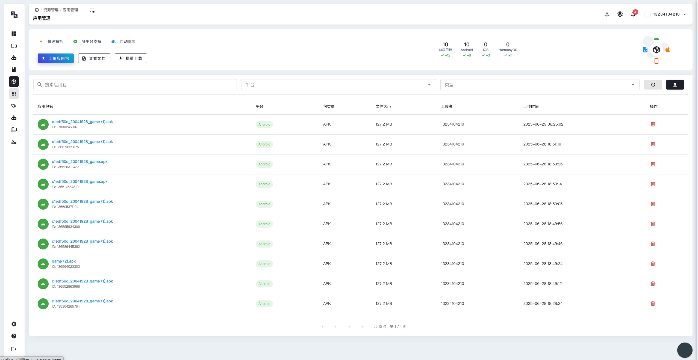

# 应用管理

## 应用管理概述

应用管理是 PandaTest 云真机测试平台的重要功能之一，为用户提供了完整的应用生命周期管理能力。通过应用管理功能，您可以轻松管理测试设备上的应用程序，包括安装、卸载、启动、数据管理等操作。

### 应用管理功能特性

- **应用列表查看**：查看设备上已安装的所有应用程序
- **应用安装**：将新的应用包（APK/IPA）安装到设备上
- **应用卸载**：移除不需要的应用程序
- **应用信息查看**：查看应用的详细信息，包括版本、权限等
- **应用启动**：快速启动指定的应用程序
- **应用数据管理**：清除应用数据或缓存
- **批量操作**：支持批量安装、卸载等操作
- **版本管理**：管理应用的不同版本

## 应用安装管理

### 应用安装方式

1. **本地文件安装**：
   - 从本地计算机上传APK/IPA文件
   - 支持拖拽方式快速上传
   - 自动检测文件格式和兼容性

2. **应用商店安装**：
   - 直接从应用商店下载安装
   - 支持搜索和选择应用
   - 自动处理依赖关系

3. **URL安装**：
   - 通过URL链接安装应用
   - 支持直接下载链接
   - 自动下载并安装

### 安装过程管理

- **安装进度监控**：实时查看安装进度
- **错误处理**：自动处理安装过程中的错误
- **权限管理**：自动处理应用权限请求
- **签名验证**：验证应用包的数字签名

## 应用信息管理

### 应用详细信息

每个应用的详细信息包括：

- **基本信息**：应用名称、包名、版本号
- **文件信息**：文件大小、安装路径、权限列表
- **运行状态**：应用运行状态、内存使用情况
- **安装时间**：首次安装时间、最后更新时间
- **数据信息**：应用数据大小、缓存大小

### 应用分类管理

- **系统应用**：设备预装的系统应用
- **用户应用**：用户安装的第三方应用
- **测试应用**：专门用于测试的应用
- **开发应用**：开发过程中的应用版本

## 应用操作功能

### 基本操作

1. **启动应用**：
   - 一键启动指定应用
   - 支持带参数启动
   - 自动切换到应用界面

2. **停止应用**：
   - 强制停止运行中的应用
   - 清理应用进程
   - 释放占用的系统资源

3. **重启应用**：
   - 快速重启应用
   - 清理应用状态
   - 恢复到初始状态

### 高级操作

1. **数据清理**：
   - 清除应用数据
   - 清除应用缓存
   - 重置应用设置

2. **权限管理**：
   - 查看应用权限
   - 修改权限设置
   - 管理敏感权限

3. **备份恢复**：
   - 备份应用数据
   - 恢复应用数据
   - 迁移应用设置

## 批量操作管理

### 批量安装

- **选择多个应用**：支持选择多个应用包进行批量安装
- **安装队列管理**：管理安装队列，控制安装顺序
- **并发安装**：支持并发安装多个应用，提高效率
- **状态监控**：实时监控批量安装的状态和进度

### 批量卸载

- **批量选择**：支持批量选择要卸载的应用
- **依赖检查**：检查应用间的依赖关系
- **确认机制**：提供确认机制，防止误操作
- **清理残留**：自动清理卸载后的残留文件

### 批量更新

- **版本检查**：自动检查应用的版本更新
- **更新推荐**：推荐需要更新的应用
- **批量更新**：支持批量更新多个应用
- **回滚功能**：支持更新后的版本回滚

## 应用测试支持

### 测试环境管理

- **应用隔离**：为不同测试场景创建隔离的应用环境
- **数据初始化**：自动初始化测试所需的应用数据
- **环境重置**：快速重置测试环境到初始状态
- **配置管理**：管理不同测试场景的应用配置

### 测试数据管理

- **测试数据准备**：准备测试所需的数据文件
- **数据导入导出**：支持测试数据的导入和导出
- **数据同步**：在多个设备间同步测试数据
- **数据清理**：测试完成后清理测试数据

## 应用性能监控

### 性能指标监控

- **CPU使用率**：监控应用的CPU使用情况
- **内存使用**：监控应用的内存占用情况
- **网络流量**：监控应用的网络使用情况
- **磁盘I/O**：监控应用的磁盘读写操作

### 性能分析报告

- **性能趋势**：分析应用性能的变化趋势
- **性能对比**：对比不同版本的性能表现
- **性能优化建议**：提供性能优化的建议
- **问题定位**：快速定位性能问题的根本原因

## 应用管理最佳实践

### 安装管理最佳实践

- **版本控制**：保持应用版本的一致性，便于测试结果比较
- **权限检查**：安装应用后检查应用权限，确保测试环境安全
- **依赖管理**：注意应用间的依赖关系，避免冲突
- **存储管理**：合理管理设备存储空间，避免空间不足

### 测试管理最佳实践

- **环境隔离**：为不同的测试项目创建独立的应用环境
- **数据备份**：在清除应用数据前，备份重要的测试数据
- **定期清理**：定期清理不需要的应用，释放设备存储空间
- **监控告警**：设置应用性能监控告警，及时发现问题

### 安全管理最佳实践

- **权限最小化**：只授予应用必要的权限
- **签名验证**：验证应用包的数字签名，确保安全
- **敏感数据保护**：保护测试过程中的敏感数据
- **访问控制**：控制对应用管理功能的访问权限

## 常见问题解决

### 安装问题

1. **安装失败**：
   - 检查应用包格式是否正确
   - 确认设备存储空间是否足够
   - 检查应用权限设置

2. **兼容性问题**：
   - 确认应用与设备系统版本兼容
   - 检查应用架构是否匹配
   - 验证应用依赖是否满足

### 运行问题

1. **启动失败**：
   - 检查应用是否正确安装
   - 确认应用权限是否充足
   - 查看应用错误日志

2. **性能问题**：
   - 监控应用资源使用情况
   - 检查设备硬件性能
   - 优化应用配置参数

### 数据问题

1. **数据丢失**：
   - 检查数据备份设置
   - 确认数据存储路径
   - 恢复数据备份

2. **数据同步问题**：
   - 检查网络连接状态
   - 确认同步设置配置
   - 重新执行数据同步

通过合理使用应用管理功能，您可以更高效地管理测试设备上的应用程序，提高测试效率和质量。 