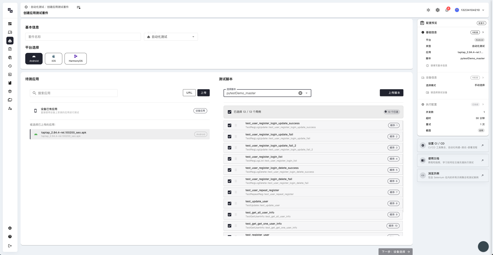

# 自动化测试套件

## 自动化测试套件创建



### 测试套件概述

自动化测试套件是 High QA 平台的重要功能，允许您创建和管理多个测试用例的集合。通过测试套件，您可以：

- **批量测试**：将多个相关的测试用例组织在一起执行
- **测试管理**：统一管理和维护测试用例
- **结果汇总**：自动汇总所有测试用例的执行结果
- **效率提升**：提高测试执行效率和覆盖率

### 测试套件创建页面功能

在测试套件创建页面中，您可以：

1. **基本信息设置**：
   - 设置测试套件的名称和描述
   - 选择测试套件的分类和标签
   - 配置测试套件的优先级

2. **测试用例管理**：
   - 添加现有的测试用例到套件中
   - 创建新的测试用例
   - 设置测试用例的执行顺序
   - 配置测试用例间的依赖关系

3. **执行配置**：
   - 设置测试套件的执行策略
   - 配置并发执行参数
   - 设置失败处理策略
   - 配置测试环境参数

### 如何创建测试套件

1. **进入创建页面**：
   - 点击"创建测试套件"按钮
   - 选择测试套件模板（如有）

2. **填写基本信息**：
   - 输入测试套件名称
   - 添加详细描述
   - 选择适当的分类和标签

3. **添加测试用例**：
   - 从现有用例库中选择测试用例
   - 设置用例的执行顺序
   - 配置用例间的依赖关系

4. **配置执行参数**：
   - 设置执行策略（顺序执行/并发执行）
   - 配置失败处理方式
   - 设置超时时间和重试次数

5. **保存和验证**：
   - 保存测试套件配置
   - 验证套件配置的正确性
   - 进行初步的测试执行

### 测试套件配置最佳实践

- **逻辑分组**：将相关的测试用例组织在同一个套件中
- **依赖管理**：合理设置测试用例间的依赖关系
- **执行策略**：根据测试需求选择合适的执行策略
- **错误处理**：设置完善的错误处理和恢复机制
- **资源管理**：合理分配测试资源，避免资源冲突

### 测试套件类型

根据不同的测试需求，可以创建不同类型的测试套件：

1. **功能测试套件**：
   - 针对应用功能的测试用例集合
   - 验证应用的各项功能是否正常
   - 包含正常流程和异常流程测试

2. **回归测试套件**：
   - 用于验证新版本是否影响现有功能
   - 包含核心功能的测试用例
   - 适用于版本发布前的验证

3. **性能测试套件**：
   - 针对应用性能的测试用例集合
   - 测试应用的响应时间和资源使用
   - 包含负载测试和压力测试

4. **兼容性测试套件**：
   - 测试应用在不同设备上的兼容性
   - 包含不同屏幕尺寸和系统版本的测试
   - 验证应用的跨平台兼容性

## 测试套件管理

### 套件组织结构

建议按照以下结构组织测试套件：

```
项目名称/
├── 冒烟测试/
│   ├── 登录流程测试套件
│   ├── 核心功能测试套件
│   └── 基础界面测试套件
├── 功能测试/
│   ├── 用户管理测试套件
│   ├── 订单管理测试套件
│   └── 支付功能测试套件
├── 回归测试/
│   ├── 版本回归测试套件
│   ├── 核心功能回归测试套件
│   └── 界面回归测试套件
└── 性能测试/
    ├── 响应时间测试套件
    ├── 内存使用测试套件
    └── 并发性能测试套件
```

### 套件执行管理

1. **执行计划**：
   - 制定测试套件的执行计划
   - 设置定时执行任务
   - 配置执行优先级

2. **资源分配**：
   - 分配合适的测试设备
   - 设置并发执行数量
   - 管理测试环境资源

3. **结果监控**：
   - 实时监控测试执行状态
   - 查看测试进度和结果
   - 处理执行中的异常

4. **报告生成**：
   - 自动生成测试报告
   - 分析测试结果趋势
   - 导出测试数据

### 套件维护

- **定期更新**：定期更新测试用例内容，保持与应用功能同步
- **性能优化**：优化测试用例执行效率，减少执行时间
- **结果分析**：分析测试结果，识别问题模式
- **版本管理**：对测试套件进行版本管理，便于追踪变更

## 自动化测试执行

### 执行前准备

1. **环境检查**：
   - 确认测试环境可用
   - 检查设备连接状态
   - 验证应用安装情况

2. **参数配置**：
   - 设置测试执行参数
   - 配置测试数据
   - 选择目标设备

3. **依赖检查**：
   - 检查测试用例依赖关系
   - 验证前置条件
   - 准备测试数据

### 执行过程监控

- **实时状态**：实时查看测试执行状态和进度
- **日志监控**：监控测试执行日志，及时发现问题
- **性能监控**：监控设备性能，确保测试环境稳定
- **异常处理**：及时处理执行过程中的异常情况

### 结果分析

1. **结果统计**：
   - 通过率统计
   - 失败原因分析
   - 执行时间统计
   - 资源使用情况

2. **趋势分析**：
   - 测试结果趋势变化
   - 问题模式识别
   - 性能变化趋势
   - 质量指标分析

3. **报告生成**：
   - 详细的测试报告
   - 图表化的结果展示
   - 问题汇总和建议
   - 测试数据导出

### 持续改进

- **用例优化**：根据执行结果优化测试用例
- **策略调整**：调整测试执行策略
- **覆盖率提升**：提高测试覆盖率
- **效率改进**：持续改进测试执行效率 