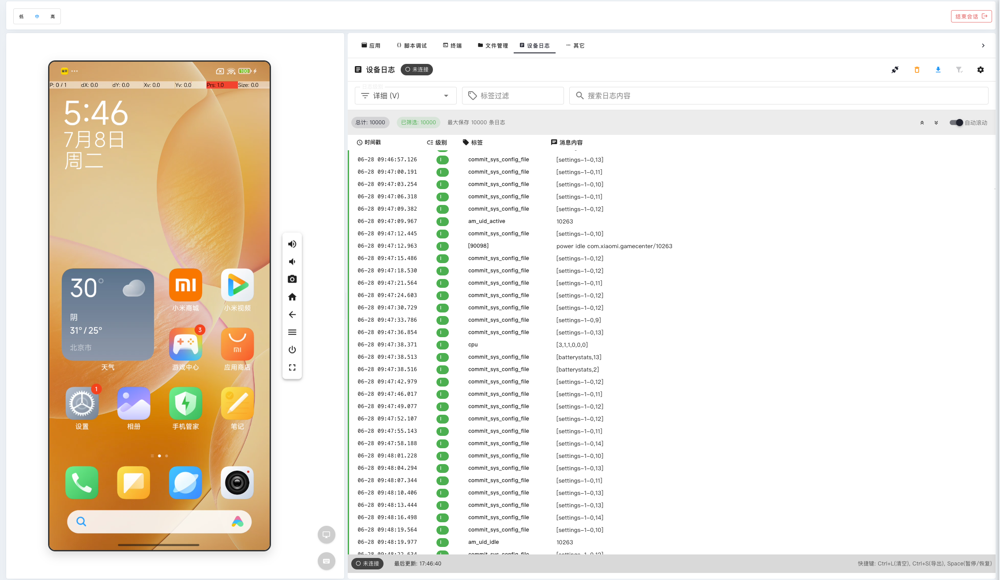
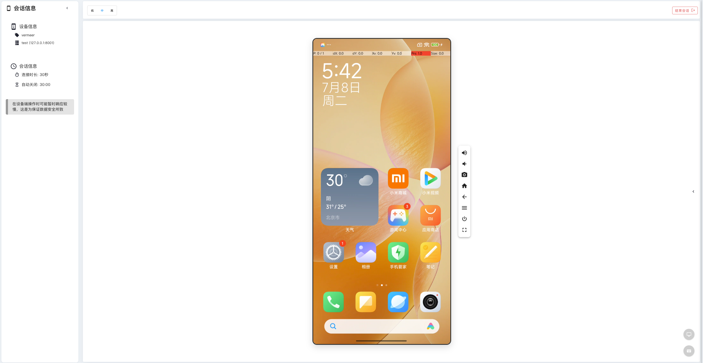
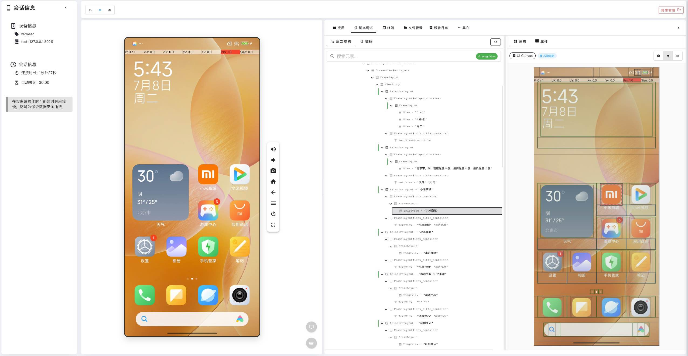
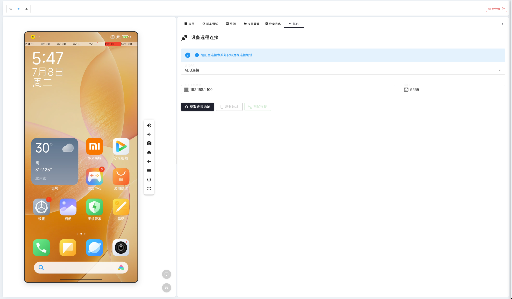

# 设备调试功能

## 设备调试日志

### 调试日志功能

设备调试日志页面是开发者和测试人员的重要工具，帮助您：

- **实时日志监控**：查看设备应用运行时的实时日志输出
- **日志分类筛选**：按照日志级别（Info、Warning、Error）进行筛选
- **关键词搜索**：通过关键词快速定位特定的日志信息
- **日志导出**：将日志信息导出为文件，便于后续分析

### 如何使用调试日志

1. **连接设备**：首先连接到您需要调试的设备
2. **启动应用**：在设备上启动需要调试的应用程序
3. **查看日志**：在右侧日志面板中查看实时的应用日志
4. **筛选日志**：使用顶部的筛选条件过滤特定类型的日志
5. **搜索关键词**：在搜索框中输入关键词快速定位相关日志
6. **导出日志**：点击导出按钮将日志保存为文件

### 日志分析技巧

- **关注错误日志**：重点关注红色标记的错误日志，这些通常是问题的根源
- **时间戳分析**：通过时间戳了解问题发生的时间顺序
- **日志级别**：根据不同级别的日志了解问题的严重程度
- **关键词筛选**：使用应用包名、类名等关键词快速定位相关日志

## 设备调试控制页面

### 调试控制功能

设备调试控制页面提供了全面的设备调试工具：

- **应用管理**：安装、卸载、启动、停止应用程序
- **文件管理**：查看和管理设备文件系统
- **性能监控**：实时监控设备性能指标
- **网络调试**：分析网络请求和响应
- **系统信息**：查看设备系统详细信息

### 使用调试控制页面

1. **应用操作**：
   - 从应用列表中选择需要调试的应用
   - 使用控制按钮启动或停止应用
   - 查看应用的详细信息和权限

2. **文件操作**：
   - 浏览设备文件系统结构
   - 上传或下载文件
   - 查看文件属性和权限

3. **性能监控**：
   - 查看 CPU、内存使用情况
   - 监控网络流量
   - 分析电池消耗

4. **系统控制**：
   - 截取屏幕截图
   - 录制屏幕视频
   - 重启设备或应用

## UI 层级结构调试

### UI 层级分析

UI 层级结构调试工具帮助您：

- **查看 UI 结构**：以树形结构展示页面的 UI 层级关系
- **元素定位**：快速定位页面中的特定 UI 元素
- **属性查看**：查看 UI 元素的详细属性和样式
- **交互测试**：直接在 UI 树中测试元素的交互行为

### UI 调试使用方法

1. **打开 UI 调试**：
   - 连接设备后，点击 UI 调试工具
   - 系统会自动分析当前页面的 UI 结构

2. **浏览 UI 树**：
   - 在左侧面板中展开 UI 树节点
   - 点击节点查看对应的 UI 元素
   - 观察元素在屏幕上的高亮显示

3. **查看元素属性**：
   - 选择 UI 元素后查看其详细属性
   - 了解元素的 ID、类名、文本内容等信息
   - 分析元素的位置和尺寸信息

4. **测试交互**：
   - 直接在 UI 树中测试元素的点击行为
   - 验证元素的可见性和可交互性
   - 测试元素的响应状态

### UI 调试最佳实践

- **逐层分析**：从根节点开始，逐层分析 UI 结构
- **属性对比**：对比相似元素的属性差异
- **交互验证**：通过 UI 树验证元素的交互逻辑
- **性能分析**：关注 UI 层级的复杂度对性能的影响

## 设备远程连接

### 远程连接功能

设备远程连接功能让您可以：

- **快速连接**：一键连接到云端的真机设备
- **稳定连接**：保持与远程设备的稳定连接
- **多设备管理**：同时管理多个设备连接
- **连接状态监控**：实时监控设备连接状态

### 如何建立远程连接

1. **选择设备**：从设备列表中选择需要连接的设备
2. **检查状态**：确认设备状态为可用（绿色指示）
3. **建立连接**：点击连接按钮开始连接过程
4. **等待连接**：系统会自动建立与设备的连接
5. **连接成功**：连接成功后即可开始远程操作设备

### 连接管理技巧

- **连接前检查**：确保设备状态正常，避免连接失败
- **网络优化**：选择网络延迟较低的设备，提高操作体验
- **连接维护**：定期检查连接状态，及时处理连接异常
- **资源管理**：合理使用设备资源，避免长时间占用 