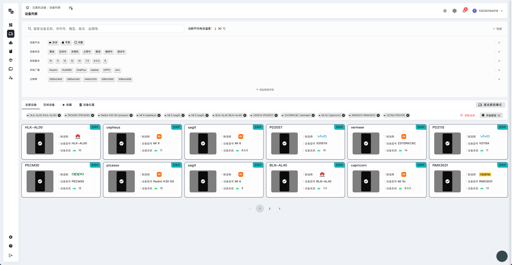

# 设备列表管理

## 设备列表概览

### 设备列表页面介绍

设备列表页面是 High QA 云真机测试平台的核心功能之一，为用户提供了直观的设备管理界面。在这个页面中，您可以：

- **查看所有可用设备**：平台会展示所有已连接的移动设备，包括 Android 和 iOS 设备
- **实时设备状态**：每个设备卡片会显示设备的实时状态，包括在线/离线、电量、型号等信息
- **快速筛选设备**：通过顶部的筛选条件快速找到需要的设备
- **一键连接设备**：点击设备卡片即可快速连接到对应设备进行测试

### 设备信息展示

每个设备卡片包含以下关键信息：

- **设备名称**：设备的标识名称，便于识别
- **设备品牌**：显示设备制造商（如华为、小米、苹果等）
- **系统版本**：设备运行的操作系统版本
- **设备状态**：绿色圆点表示设备在线可用，红色表示离线
- **电量显示**：实时显示设备当前电量百分比
- **连接状态**：显示设备是否被占用或空闲

### 设备列表页面选择

在设备列表页面，您可以：

1. **浏览所有设备**：滚动查看平台上所有可用的测试设备
2. **选择目标设备**：根据测试需求选择合适的设备型号和系统版本
3. **查看设备详情**：点击设备卡片查看更详细的设备信息
4. **快速连接**：选择设备后快速建立连接开始测试

### 使用技巧

- **设备筛选**：使用页面顶部的筛选功能快速定位需要的设备类型
- **收藏常用设备**：将经常使用的设备添加到收藏夹，方便快速访问
- **设备状态监控**：关注设备状态指示器，选择空闲状态的设备进行测试
- **批量操作**：选择多个设备进行批量测试任务

## 设备性能监控

### 性能监控功能

设备性能监控页面帮助您：

- **实时性能数据**：查看设备的 CPU、内存、网络等实时性能指标
- **性能趋势分析**：通过图表了解设备性能随时间的变化趋势
- **资源使用监控**：监控设备资源使用情况，确保测试环境稳定
- **性能报告**：生成详细的性能监控报告，用于测试结果分析

### 如何使用性能监控

1. **访问性能监控**：在设备连接后，点击性能监控标签页
2. **选择监控指标**：选择需要监控的性能指标（CPU、内存、网络等）
3. **设置监控时间**：配置监控的时间间隔和持续时间
4. **查看实时数据**：在图表中查看实时的性能数据变化
5. **导出报告**：将性能监控数据导出为报告文件

## 设备位置视图

### 位置视图功能

设备位置视图为您提供：

- **地理位置展示**：在地图上直观显示设备的地理位置
- **设备分布情况**：了解测试设备在全球的分布情况
- **就近选择设备**：根据地理位置选择最近的设备，减少网络延迟
- **位置信息管理**：管理和更新设备的位置信息

### 使用位置视图

1. **查看设备分布**：在地图上查看所有设备的地理分布
2. **选择就近设备**：根据您的位置选择最近的设备进行测试
3. **位置筛选**：按照地理位置筛选设备，提高测试效率
4. **网络优化**：选择地理位置较近的设备，获得更好的网络连接质量 