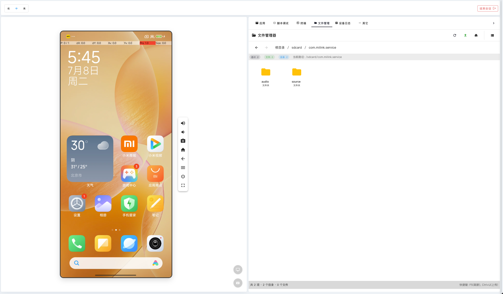

# 脚本录制与调试

## 设备脚本录制

### 脚本录制功能

设备脚本录制是 High QA 平台的核心功能之一，允许您记录在设备上的操作步骤，并生成可重复执行的自动化脚本。

主要功能包括：

- **实时录制**：实时记录您在设备上的所有操作
- **智能识别**：自动识别UI元素和用户操作
- **脚本生成**：自动生成标准化的测试脚本
- **即时回放**：录制完成后立即回放验证

### 如何开始脚本录制

1. **连接设备**：首先连接到需要录制脚本的设备
2. **准备应用**：确保目标应用已安装并可以正常运行
3. **启动录制**：点击录制按钮开始录制模式
4. **执行操作**：在设备上执行需要记录的操作步骤
5. **停止录制**：完成操作后点击停止录制按钮
6. **保存脚本**：为录制的脚本命名并保存

### 录制过程中的注意事项

- **操作清晰**：确保每个操作都清晰明确，避免无效操作
- **等待时间**：在页面加载或动画完成后再进行下一步操作
- **操作顺序**：按照逻辑顺序执行操作，确保脚本的连贯性
- **关键节点**：在关键操作点暂停，确保脚本记录准确

### 脚本录制的最佳实践

- **事前规划**：录制前规划好操作流程和步骤
- **环境准备**：确保设备环境干净，避免干扰因素
- **操作标准化**：使用标准化的操作方式，提高脚本质量
- **及时验证**：录制完成后立即进行验证和调试

## 脚本调试属性详情

### 脚本调试功能

脚本调试属性详情页面提供了详细的脚本调试功能，帮助您分析和优化脚本性能：

- **步骤分析**：查看脚本中每个步骤的详细信息
- **属性查看**：查看每个操作的具体属性和参数
- **执行状态**：监控脚本执行过程中的状态变化
- **错误诊断**：快速定位和诊断脚本执行中的问题

### 调试信息内容

脚本调试页面包含以下信息：

1. **操作序列**：按时间顺序显示所有操作步骤
2. **元素信息**：每个操作涉及的UI元素详细信息
3. **参数设置**：操作的具体参数和配置
4. **执行时间**：每个步骤的执行时间和响应时间
5. **状态变化**：操作前后的状态变化情况

### 如何使用脚本调试

1. **选择脚本**：选择需要调试的脚本文件
2. **开始调试**：启动调试模式，系统会逐步执行脚本
3. **查看详情**：点击每个步骤查看详细的属性信息
4. **分析问题**：根据调试信息分析脚本中的问题
5. **修改优化**：根据分析结果修改和优化脚本

### 调试技巧

- **断点设置**：在关键步骤设置断点，便于详细分析
- **日志查看**：结合日志信息进行深入的问题分析
- **性能监控**：关注脚本执行的性能指标
- **异常处理**：完善脚本的异常处理机制

## 文件管理功能

### 设备文件夹管理

设备文件夹管理功能允许您直接管理设备上的文件和文件夹：

- **文件浏览**：浏览设备上的文件系统结构
- **文件操作**：创建、删除、重命名文件和文件夹
- **文件传输**：在设备和电脑之间传输文件
- **权限管理**：查看和修改文件的权限设置

### 文件管理操作

1. **文件浏览**：
   - 浏览设备的文件系统结构
   - 查看文件和文件夹的详细信息
   - 按照文件类型和大小进行排序

2. **文件操作**：
   - 创建新的文件夹
   - 删除不需要的文件
   - 重命名文件和文件夹
   - 复制和移动文件

3. **文件传输**：
   - 从电脑上传文件到设备
   - 从设备下载文件到电脑
   - 批量传输多个文件
   - 传输进度监控

### 设备文件夹管理2

高级文件管理功能包括：

- **文件搜索**：在设备上搜索特定的文件
- **文件预览**：预览图片、文档等文件内容
- **文件分享**：将文件分享给其他用户或设备
- **文件压缩**：压缩和解压缩文件

### 文件管理最佳实践

- **权限管理**：注意文件权限设置，避免权限问题
- **空间管理**：定期清理不需要的文件，释放存储空间
- **备份重要文件**：定期备份重要的测试文件和脚本
- **文件组织**：建立良好的文件组织结构，便于管理

## 设备终端管理

### 终端管理功能

设备终端管理功能提供了强大的命令行操作能力：

- **命令执行**：在设备上执行各种命令行命令
- **系统监控**：监控设备的系统状态和性能
- **日志查看**：查看系统日志和应用日志
- **进程管理**：管理设备上运行的进程

### 终端操作

1. **连接终端**：建立与设备终端的连接
2. **命令执行**：输入和执行命令行命令
3. **结果查看**：查看命令执行的结果和输出
4. **会话管理**：管理多个终端会话

### 常用终端命令

- **系统信息**：查看设备的系统信息和硬件配置
- **进程管理**：查看和管理运行中的进程
- **网络检查**：检查网络连接和配置
- **文件操作**：使用命令行进行文件操作

### 终端使用技巧

- **命令历史**：使用命令历史功能提高操作效率
- **快捷键**：掌握常用的快捷键操作
- **脚本执行**：编写和执行自动化脚本
- **安全操作**：谨慎使用系统级命令，避免误操作 