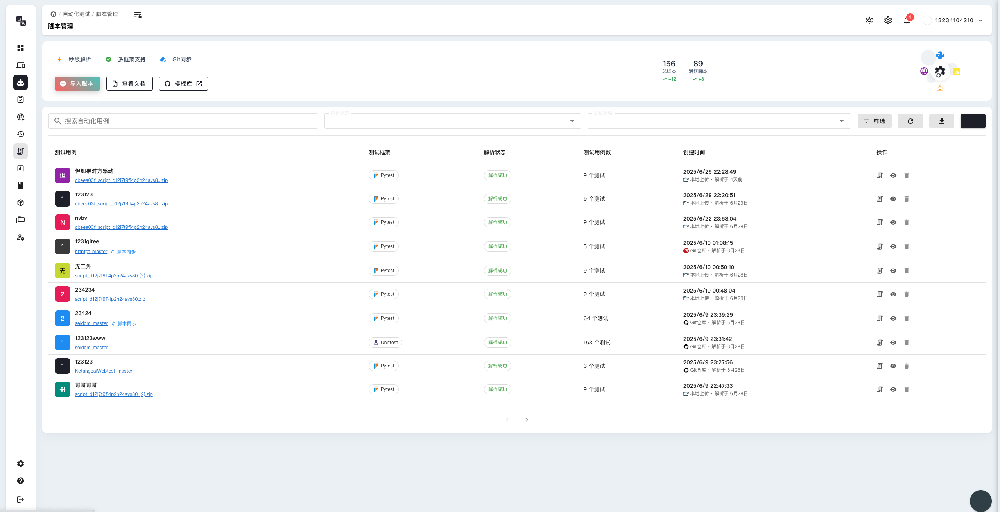
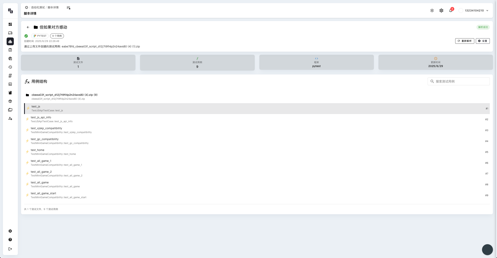

# 测试及脚本管理



## 测试脚本概述

测试脚本是自动化测试的核心组件，PandaTest 平台提供了完整的脚本管理功能，帮助您创建、编辑、组织和执行测试脚本。

### 脚本管理功能

- **脚本创建**：支持多种方式创建测试脚本
- **脚本编辑**：提供可视化和代码编辑模式
- **脚本组织**：按项目、功能模块组织脚本
- **版本控制**：脚本版本管理和历史记录
- **脚本执行**：单个或批量执行脚本
- **结果分析**：详细的执行结果和报告

## 脚本创建方式

### 1. 录制脚本

通过操作录制自动生成脚本：

1. **连接设备**：选择目标测试设备
2. **开始录制**：点击录制按钮开始记录操作
3. **执行操作**：在设备上执行需要测试的操作流程
4. **停止录制**：完成操作后停止录制
5. **保存脚本**：为脚本命名并保存到指定位置

### 2. 手动编写

直接编写测试脚本代码：

1. **创建脚本**：新建空白脚本文件
2. **编写代码**：使用平台提供的API编写测试逻辑
3. **调试验证**：调试脚本确保功能正确
4. **保存发布**：保存脚本并发布供使用

### 3. 模板创建

基于现有模板快速创建脚本：

1. **选择模板**：从模板库选择合适的模板
2. **参数配置**：根据需求配置模板参数
3. **自定义修改**：根据具体需求修改模板内容
4. **保存脚本**：保存自定义后的脚本

## 脚本编辑功能

### 可视化编辑

- **拖拽操作**：通过拖拽方式组织测试步骤
- **参数配置**：可视化配置每个步骤的参数
- **流程图显示**：以流程图形式展示测试流程
- **实时预览**：实时预览脚本执行效果

### 代码编辑

- **语法高亮**：提供代码语法高亮显示
- **智能提示**：代码自动补全和智能提示
- **语法检查**：实时检查代码语法错误
- **格式化**：代码自动格式化和美化

## 脚本组织管理

### 项目结构

建议按照以下结构组织测试脚本：

```
项目名称/
├── 登录模块/
│   ├── 正常登录.script
│   ├── 异常登录.script
│   └── 登录安全.script
├── 用户管理/
│   ├── 用户注册.script
│   ├── 用户信息编辑.script
│   └── 用户权限.script
├── 订单管理/
│   ├── 订单创建.script
│   ├── 订单支付.script
│   └── 订单查询.script
└── 通用脚本/
    ├── 数据准备.script
    ├── 环境清理.script
    └── 通用操作.script
```

### 脚本分类

根据功能和用途对脚本进行分类：

1. **功能测试脚本**：
   - 验证应用各项功能是否正常
   - 包含正常流程和异常流程
   - 覆盖主要业务场景

2. **回归测试脚本**：
   - 验证新版本对现有功能的影响
   - 包含核心功能的验证
   - 适用于版本发布前的回归测试

3. **性能测试脚本**：
   - 测试应用的性能指标
   - 包含响应时间、内存使用等测试
   - 用于性能基准测试

4. **兼容性测试脚本**：
   - 测试应用在不同设备上的兼容性
   - 包含不同屏幕尺寸、系统版本的测试
   - 验证跨平台兼容性

## 脚本执行管理

### 单个脚本执行

1. **选择脚本**：从脚本库中选择要执行的脚本
2. **选择设备**：选择执行脚本的目标设备
3. **参数配置**：设置脚本执行的参数
4. **开始执行**：启动脚本执行
5. **监控执行**：实时监控脚本执行状态
6. **查看结果**：查看执行结果和报告

### 批量脚本执行

1. **选择脚本组**：选择需要批量执行的脚本
2. **设备分配**：为每个脚本分配执行设备
3. **执行策略**：设置执行顺序和并发策略
4. **开始执行**：启动批量执行
5. **进度监控**：监控整体执行进度
6. **结果汇总**：汇总所有脚本的执行结果

### 定时执行

- **执行计划**：设置脚本的定时执行计划
- **循环执行**：配置脚本的循环执行规则
- **触发条件**：设置脚本执行的触发条件
- **通知设置**：配置执行结果的通知方式

## 脚本调试



### 调试功能

- **断点设置**：在关键步骤设置断点
- **单步执行**：逐步执行脚本步骤
- **变量查看**：查看脚本执行过程中的变量值
- **日志输出**：查看详细的执行日志
- **错误定位**：快速定位脚本错误位置

### 调试最佳实践

- **分段调试**：将复杂脚本分段进行调试
- **日志记录**：在关键步骤添加日志记录
- **异常处理**：完善脚本的异常处理机制
- **性能优化**：优化脚本执行效率

## 脚本维护

### 版本管理

- **版本控制**：对脚本进行版本管理
- **变更记录**：记录脚本的变更历史
- **版本比较**：比较不同版本的差异
- **版本回滚**：支持版本回滚操作

### 脚本优化

- **性能优化**：优化脚本执行效率
- **代码重构**：重构脚本代码提高可维护性
- **通用化**：将通用逻辑抽象为公共函数
- **文档完善**：完善脚本的使用文档

### 质量保证

- **代码审查**：对脚本代码进行审查
- **测试验证**：验证脚本的正确性和稳定性
- **标准化**：制定脚本开发标准和规范
- **持续改进**：根据使用反馈持续改进脚本 